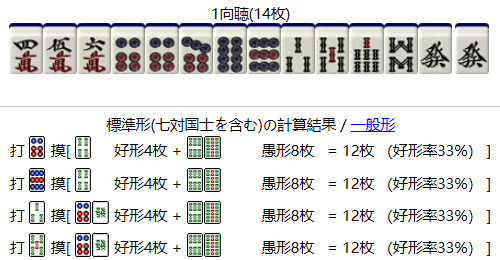
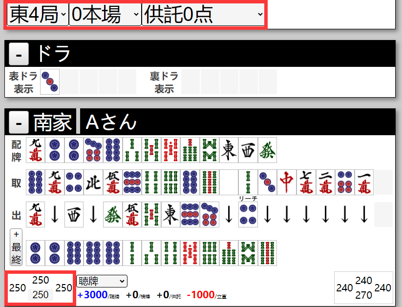
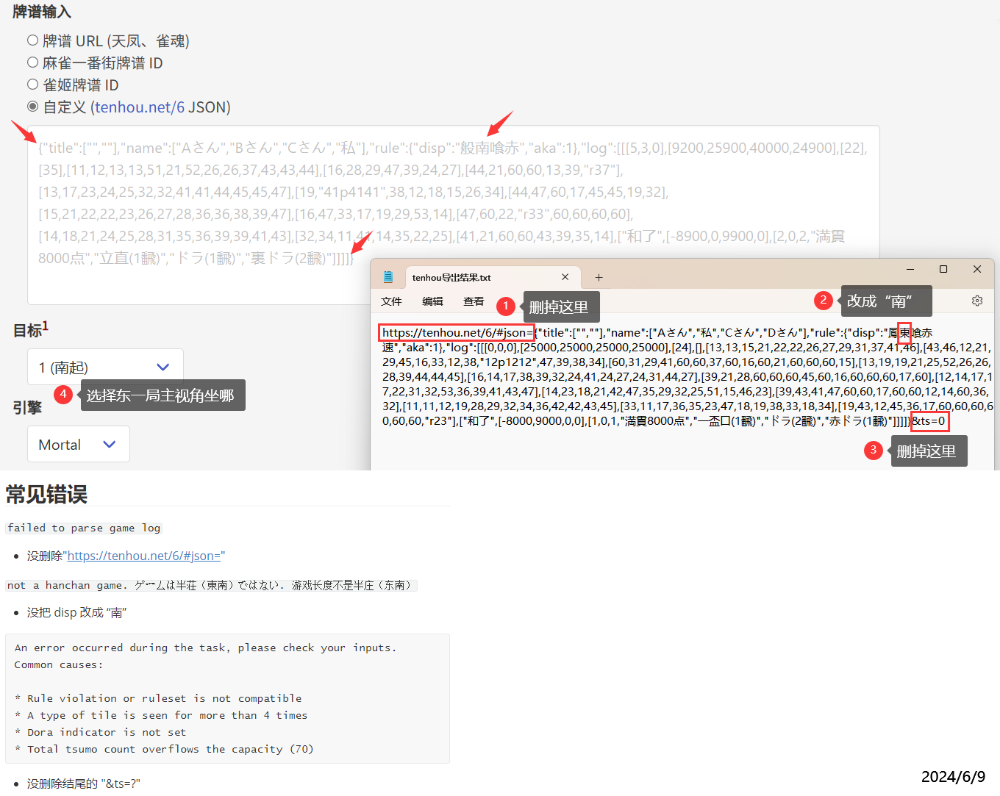
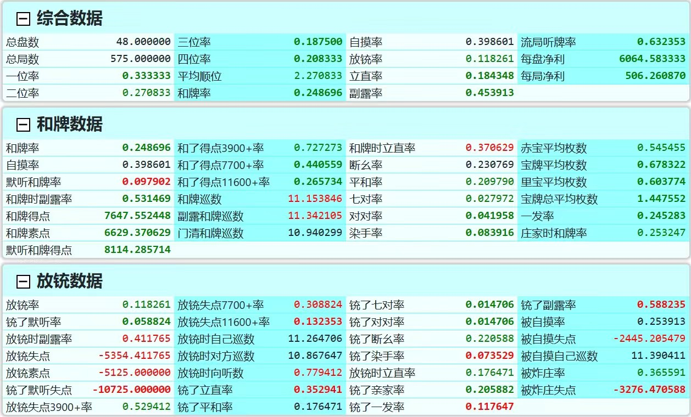

# Awesome Mahjong

- [Awesome Mahjong](#awesome-mahjong)
  - [日麻书籍资料](#日麻书籍资料)
  - [常用网站](#常用网站)
  - [ai 看谱](#ai-看谱)
    - [Mortal (免费)](#mortal-免费)
    - [Naga (付费)](#naga-付费)
    - [修改牌谱](#修改牌谱)
      - [比赛场牌谱点数自动修改](#比赛场牌谱点数自动修改)
      - [手动修改](#手动修改)
  - [其他工具](#其他工具)
    - [QQ机器人](#qq机器人)
    - [分析工具](#分析工具)

## 日麻书籍资料

* b站有大部分书籍的汉化版，up主光之行方做过[汇总和推荐视频](https://www.bilibili.com/video/BV1Vc411c7gF/)，置顶评论中有推荐书籍的专栏链接，包括但不限于：[79博客](https://www.bilibili.com/read/readlist/rl45758)，[麻将学习·牌效率](https://www.bilibili.com/read/readlist/rl509592)，[何切300](https://www.bilibili.com/read/readlist/rl380536)
* [日麻战术书链接合集](https://www.bilibili.com/read/cv18813609/)，b站南极大熊熊，除书籍以外还包括**国内爱好者随笔和杂谈**
* 其他推荐
  * [副露读牌体系化讲座](https://www.bilibili.com/read/readlist/rl119814)，b站纯全三色对对和
  * naga研究：[带亚两面型的两好型平和一向听，固定雀头吗？](https://b23.tv/9mhmypr)，b站谙锦
  * naga研究：[何切300选的NAGA分析](https://www.bilibili.com/read/readlist/rl499000)，b站纯能量

## 常用网站

* [雀魂牌谱屋](https://amae-koromo.sapk.ch/)，[github项目地址](https://github.com/SAPikachu/amae-koromo)
* [天凤水表网](https://nodocchi.moe/)
* [天凤牌理](https://tenhou.net/2/)
  * [greasy fork插件-天鳳牌理好形表示](https://greasyfork.org/zh-CN/scripts/435111-天鳳牌理好形表示)，b站谷戻り

    

## ai 看谱

### Mortal (免费)

* [在线网站](https://mjai.ekyu.moe/zh-cn.html)
* [相关插件](https://www.bilibili.com/read/cv24013028/)，b站魔方12139：显示恶手率，保存rating等数据到excel

  
github 仓库

  * [https://github.com/Equim-chan/mjai-reviewer](https://github.com/Equim-chan/mjai-reviewer)

  * [https://github.com/killerducky/killer_mortal_gui](https://github.com/killerducky/killer_mortal_gui)

  * [https://github.com/Equim-chan/Mortal](https://github.com/Equim-chan/Mortal)

### Naga (付费)

* [在线网站](https://naga.dmv.nico/naga_report/order_form/)
* [naga使用介绍视频](https://www.bilibili.com/video/BV14s4y1x7an/)，b站多肉动物
* 雀魂牌谱转换工具
  * [浏览器插件](https://www.bilibili.com/read/cv17873540/)，b站五里梦中_，[edge插件链接](https://microsoftedge.microsoft.com/addons/detail/雀魂牌谱分析助手/jopdfhmfehndjpnjjidmkkmjmkaebodb?hl=zh-CN)，[chrome插件链接](https://chrome.google.com/webstore/detail/mahjongsoul-review-suppor/kdmfnkdgpialmejpgflfllkjakolamcc?hl=zh-CN)
  * [油猴脚本](https://www.bilibili.com/video/BV1hL411K7eM/)，b站桔猫Orzcat，置顶评论中有[脚本链接](https://pan.baidu.com/s/1-OCScZ4F3tInqzy2YY_t0A?pwd=wbhp)
  * [在线网站majsoul2naga](https://www.majsoul2naga.com/)
* [NAGA助手](https://ricochet.cn/riichi/naga)，b站嘉宁的多重宇宙
  * 功能：自动转天凤牌谱 / 小局选择 / 多账号管理 / NP点数分享 / NAGA网络代理
  * [介绍视频](https://www.bilibili.com/video/BV1XW421N7eL/)

### 修改牌谱

#### 比赛场牌谱点数自动修改

* [一个用gpt写的简单python脚本](./tool/comp2naga.py)，使用`pyinstaller -F`打包的[exe版本](./tool/comp2naga.exe)（双击后根据提示使用即可）
* 功能：将联赛谱转为平场谱跑naga，南场 -> 东场，四家分数 -> 25000
* 输入：input.txt, json格式的联赛牌谱
* 输出：output.txt, json格式的平场牌谱

#### 手动修改

0. 获得牌谱：雀魂牌谱使用上文中的转谱工具，天凤牌谱直接导出 MJLOG editor 即可

1. 浏览器访问`https://tenhou.net/6/#json=`开头的牌谱链接

2. 修改场况

    

3. 修改手牌，第一行表示起手配牌，第二行表示摸的牌，第三行表示打的牌

    

4. 修改完后复制地址栏的链接去跑naga就可以了

    

5. 如果是跑mortal需要做以下改动

    

## 其他工具

### QQ机器人

* Freeze_Kirin
* 拉克丝
* [相关github项目](https://github.com/NekoRabi/Majsoul-QQBot)

### 分析工具

* [MajsoulPaipuAnalyzer](https://github.com/zyr17/MajsoulPaipuAnalyzer)，用于分析给出牌谱中每个玩家的和铳数据等

  

